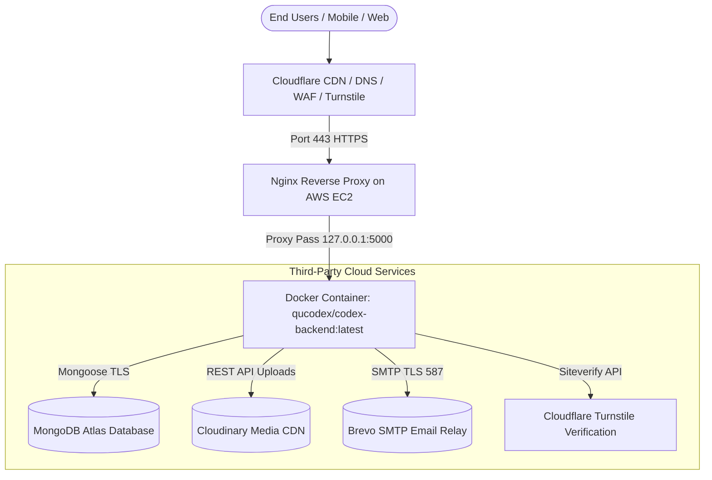

# AWS Production Deployment, External Services Setup & Disaster Recovery Runbook

This document is the comprehensive operating guide for deploying the **CodeX Backend** on **Amazon Web Services (AWS EC2)**, configuring all third-party integrations (**MongoDB Atlas, Cloudflare, Cloudinary, Brevo SMTP**), and recovering the service from scratch in the event of an outage.

Any developer or DevOps engineer can follow this guide to bring the entire system online and troubleshoot every edge case.

---

## Architecture & Data Flow



- **Production API URL:** `https://api.qucodex.com`
- **Internal Port:** `5000` (strictly bound to `127.0.0.1:5000` inside Docker)
- **Healthcheck Endpoint:** `https://api.qucodex.com/api/v1/healthcheck`
- **Automated Deployment Script:** [`deploy-shareable.sh`](../deploy-shareable.sh)

---

## Part 1: Initial AWS EC2 Setup (From Scratch)

Follow these steps when provisioning a new server on AWS.

### 1. Launch EC2 Instance

1. Log in to the [AWS EC2 Console](https://console.aws.amazon.com/ec2/).
2. Click **Launch an instance**.
3. Configure the following parameters:
   - **Name:** `codex-production-backend`
   - **AMI (Operating System):** `Ubuntu Server 24.04 LTS` or `Ubuntu Server 22.04 LTS` (64-bit x86 architecture).
   - **Instance Type:** `t3.small` (recommended for production: 2 vCPU, 2 GB RAM) or `t3.micro` / `t2.micro` (minimum).
   - **Key Pair:** Select your existing key pair or generate a new `.pem` key (e.g., `codex-key.pem`). Save this key securely.

### 2. Configure Security Group (Firewall)

In **Network settings**, create or select a Security Group with these exact **Inbound Rules**:

| Type | Protocol | Port | Source | Description |
|---|---|---|---|---|
| **SSH** | TCP | `22` | `My IP` (or Admin CIDR) | Remote terminal access |
| **HTTP** | TCP | `80` | `0.0.0.0/0` (Anywhere) | Certbot Let's Encrypt SSL & HTTP redirects |
| **HTTPS** | TCP | `443` | `0.0.0.0/0` (Anywhere) | Encrypted API traffic from clients |

> [!CAUTION]
> **Never open port 5000 or port 27017 to `0.0.0.0/0`**. Port 5000 is bound strictly to `127.0.0.1` and proxied through Nginx. Exposing raw application ports bypasses rate limiting, SSL, and security headers.

### 3. Configure Storage

- Root Volume: **20 GB gp3 SSD** (general purpose, 3000 IOPS).
- Click **Launch instance**.

### 4. Allocate & Associate an Elastic IP (Critical for High Availability)

An **Elastic IP (EIP)** is a permanent static IPv4 address. Without it, AWS assigns a new IP address every time the instance is stopped or rebuilt.

1. Navigate to **EC2 Console** > **Network & Security** > **Elastic IPs**.
2. Click **Allocate Elastic IP address** > **Allocate**.
3. Select the new Elastic IP > **Actions** > **Associate Elastic IP address**.
4. Select your instance (`codex-production-backend`) and click **Associate**.
5. Note this Elastic IP (e.g. `13.235.120.45`).

---

## Part 2: External Services Setup Guides

Before running the deployment script, set up and verify the following 4 cloud services:

---

### 2.1 MongoDB Atlas Setup

MongoDB Atlas is the managed database provider for CodeX.

#### Step 1: Create Cluster
1. Log in to [MongoDB Atlas](https://cloud.mongodb.com/).
2. Create a cluster (e.g., `CodeX` cluster on AWS in `ap-south-1` Mumbai).

#### Step 2: Create Database User
1. Go to **Security** > **Database Access** > **Add New Database User**.
2. **Authentication Method:** Password.
3. **Username:** `codexclub_db_user` (or your chosen username).
4. **Password:** Generate a strong password (minimum 16 characters).
5. **Database User Privileges:** `Read and write to any database` (or specific to `codex` db).
6. Click **Add User**.

#### Step 3: Configure Network Access (IP Access List)
> [!IMPORTANT]
> **MongoDB Atlas rejects connections by default** unless the client IP is whitelisted.
1. Go to **Security** > **Network Access** > **Add IP Address**.
2. **Option A (Recommended for Production):** Add your AWS EC2 Elastic IP address (e.g., `13.235.120.45/32`) with comment `AWS EC2 Backend Elastic IP`.
3. **Option B (Zero downtime on IP changes):** Add `0.0.0.0/0` (Allow access from anywhere) and rely on strong database credentials and scram-sha-1/256 authentication.

#### Step 4: Obtain Connection String
1. Go to **Database** > **Deployments** > Click **Connect** on your cluster.
2. Select **Drivers** (Node.js version 5.5 or later).
3. Copy the URI. Format:
   ```text
   mongodb+srv://<username>:<password>@cluster0.xxxxx.mongodb.net/codex?retryWrites=true&w=majority&appName=CodeX
   ```
4. Replace `<username>` and `<password>` with the actual database credentials.

---

### 2.2 Cloudflare Setup (DNS, SSL/TLS & Turnstile)

Cloudflare handles DNS routing, DDoS protection, edge caching, and bot validation.

#### Step 1: Configure DNS Records
1. Log in to the [Cloudflare Dashboard](https://dash.cloudflare.com/).
2. Select your domain (`qucodex.com`).
3. Navigate to **DNS** > **Records** > **Add record**:
   - **Type:** `A`
   - **Name:** `api` (resolves to `api.qucodex.com`)
   - **IPv4 address:** Your AWS EC2 **Elastic IP** (e.g. `13.235.120.45`)
   - **Proxy status:**
     - **Initial Setup:** Set to **DNS Only (Grey Cloud)** so Let's Encrypt Certbot can issue the SSL certificate via port 80 HTTP challenge.
     - **Post Setup:** Once SSL is issued on the server, you may switch to **Proxied (Orange Cloud)** for Cloudflare CDN and WAF protection.
   - **TTL:** `Auto`

#### Step 2: Configure Cloudflare SSL/TLS Encryption Mode
1. In Cloudflare, navigate to **SSL/TLS** > **Overview**.
2. Select **Full (strict)** encryption mode.

> [!WARNING]
> **Avoid "Flexible" SSL Mode!** If Cloudflare is set to Flexible, Cloudflare sends plain HTTP to your server on port 80, but Nginx automatically redirects HTTP to HTTPS on port 443. This causes an infinite redirect loop (`ERR_TOO_MANY_REDIRECTS`). Always set Cloudflare SSL/TLS to **Full (strict)**.

#### Step 3: Cloudflare Turnstile Setup (Bot Protection)
CodeX uses Cloudflare Turnstile to protect registration and authentication routes from automated bots.
1. In Cloudflare Dashboard, go to **Turnstile** > **Add Site**.
2. **Site name:** `CodeX Production`
3. **Domain:** Add `qucodex.com`, `www.qucodex.com`, and `api.qucodex.com`.
4. **Widget Mode:** Managed (invisible or smart interactive).
5. Click **Create**:
   - Copy **Site Key** -> Provide this to Frontend (`VITE_TURNSTILE_SITE_KEY`).
   - Copy **Secret Key** -> Provide this to Backend (`TURNSTILE_SECRET_KEY`).

---

### 2.3 Cloudinary Setup (Media & Image Storage)

CodeX uses Cloudinary for storing user avatars, event banners, team photos, and boarding passes.

#### Step 1: Retrieve API Credentials
1. Log in to [Cloudinary Console](https://console.cloudinary.com/).
2. On the **Dashboard**, locate the **Product Environment Credentials**:
   - **Cloud Name:** (e.g. `fswmfdcp`)
   - **API Key:** (e.g. `857412934439237`)
   - **API Secret:** Click the eye icon to reveal the secret.

#### Step 2: Verify Upload Limits & Formats
1. In **Settings** > **Upload**, ensure standard image formats (`.webp`, `.jpg`, `.png`, `.svg`) are allowed.
2. Max file size in CodeX backend is 50MB. Verify your Cloudinary account tier accommodates your expected monthly bandwidth.

---

### 2.4 Email Service Setup: AWS SES (Production) & Brevo (Temporary / Backup)

CodeX uses standard SMTP transport to send verification OTPs, event registration tickets, certificates, boarding passes, and admin notifications.

- **Primary Production Provider:** **AWS SES (Amazon Simple Email Service)** — Highly scalable, cost-effective, native to the AWS infrastructure, and ensures enterprise-grade deliverability.
- **Temporary / Backup Provider:** **Brevo (formerly Sendinblue)** — Ideal for rapid temporary setup, staging, or as an immediate fallback while awaiting AWS SES production quota approval.

---

#### 2.4.1 AWS SES Setup (Primary Production)

##### Step 1: Verify Domain Identity in Amazon SES
1. In the AWS Management Console, navigate to **Amazon Simple Email Service (SES)** (recommended region: `ap-south-1` Mumbai or `us-east-1` N. Virginia).
2. Go to **Configuration** > **Identities** > Click **Create identity**.
3. Select **Domain** and enter `qucodex.com`.
4. Enable **Easy DKIM**:
   - DKIM signing key length: `RSA 2048-bit`.
   - Publish DNS records: SES displays **3 CNAME records** for Easy DKIM verification.
5. In **Cloudflare DNS**, add all 3 CNAME records provided by SES. Verification usually completes within 1–5 minutes.

##### Step 2: Configure Custom MAIL FROM Domain & DNS Authentication
To ensure high deliverability and prevent emails from landing in spam:
1. In SES under Identity details for `qucodex.com`, scroll to **Custom MAIL FROM domain**:
   - Click **Set custom MAIL FROM domain**.
   - Subdomain: `mail.qucodex.com`.
   - Behavior on MX failure: `Use default MAIL FROM domain`.
2. In **Cloudflare DNS**, add the required DNS records:
   - **MX Record:** Name: `mail`, Mail Server: `feedback-smtp.<region>.amazonses.com` (e.g. `feedback-smtp.ap-south-1.amazonses.com`), Priority: `10`.
   - **SPF TXT Record:** Name: `mail`, Content: `v=spf1 include:amazonses.com ~all`.
   - **Root SPF TXT Record:** Name: `@`, Content: `v=spf1 include:amazonses.com ~all` (if you already have an SPF record, append `include:amazonses.com`).
   - **DMARC TXT Record:** Name: `_dmarc`, Content: `v=DMARC1; p=none; rua=mailto:admin@qucodex.com`.

##### Step 3: Request Production Access (Moving Out of SES Sandbox)
> [!IMPORTANT]
> All new AWS SES accounts start in the **SES Sandbox**. In sandbox mode, you can **only send emails to pre-verified email addresses** or recipient domains. To send to all students and users:
1. In SES Console, navigate to **Account dashboard**.
2. Under **Sandbox status**, click **Request production access**:
   - **Mail type:** Transactional (OTPs, event tickets, system receipts).
   - **Website URL:** `https://qucodex.com`.
   - **Use case description:** State that emails are purely transactional (registration OTPs, certificate delivery, boarding passes) sent only to registered users with bounce and complaint monitoring.
3. AWS approves production access typically within 12–24 hours.

##### Step 4: Generate SES SMTP Credentials
1. In the SES Console left sidebar, click **SMTP Settings**.
2. Note your **SMTP endpoint**: e.g., `email-smtp.ap-south-1.amazonaws.com` (or your chosen AWS region).
3. Port: `587` (STARTTLS).
4. Click **Create SMTP credentials**:
   - AWS automatically generates an IAM user (e.g. `ses-smtp-user.codex`) with policy `AmazonSesSendingAccess`.
   - Click **Create credentials** and immediately download/copy the generated **SMTP Username** and **SMTP Password**.
   *(Note: The SES SMTP password is a specially transformed version of the IAM secret key for SMTP authentication).*

---

#### 2.4.2 Brevo Setup (Temporary / Fallback)

If AWS SES is pending production quota approval or you need a quick temporary email relay:
1. Log in to [Brevo](https://app.brevo.com/).
2. Click your account profile > **SMTP & API** > **SMTP** tab.
3. Note **SMTP Server:** `smtp-relay.brevo.com`, **Port:** `587`.
4. Click **Generate a new SMTP key** and copy it as your `SMTP_PASSWORD`.
5. Under **Senders, Domains & IPs** > **Senders**, ensure `noreply@qucodex.com` is listed and verified.

---

## Part 3: Deployment via `deploy-shareable.sh`

Once the AWS EC2 instance is created and third-party credentials are ready:

### 1. Connect to EC2 via SSH
```bash
chmod 400 path/to/codex-key.pem
ssh -i "path/to/codex-key.pem" ubuntu@<YOUR_ELASTIC_IP>
```

### 2. Clone the Repository & Run the Script
```bash
# Update package list and install git
sudo apt update && sudo apt install -y git

# Clone CodeX repository
git clone https://github.com/QuCodeXClub/CodeX.git
cd CodeX

# Ensure script is executable
chmod +x deploy-shareable.sh

# Run the automated deployment script
./deploy-shareable.sh
```

### 3. Configuration Prompts Reference Table

The script prompts for each configuration item. You can press <kbd>Enter</kbd> to accept defaults/samples or enter custom values:

| Variable | Recommended Production Value | Description |
|---|---|---|
| `DOMAIN` | `api.qucodex.com` | Public API domain name |
| `EMAIL` | `codex.club@quantumeducation.in` | Alert email for Certbot SSL renewals |
| `PORT` | `5000` | Internal Node.js port (mapped in Docker) |
| `CORS_ORIGIN` | `https://qucodex.com,https://www.qucodex.com` | Allowed origins for web requests |
| `FRONTEND_URL` | `https://qucodex.com` | Base URL used in emails and QR links |
| `CONTAINER_NAME` | `codex-backend` | Docker container identifier |
| `IMAGE` | `qucodex/codex-backend:latest` | Production image on Docker Hub |
| `DOCKER_USER` | `qucodex` | Docker Hub username/org |
| `DOCKER_TOKEN` | *Your Docker PAT* | Personal Access Token (or Enter for public pull) |
| `MONGODB_URI` | `mongodb+srv://...` | Full MongoDB Atlas connection string |
| `ACCESS_TOKEN_SECRET` | *Press Enter to auto-generate* | 64-character random cryptographically secure key |
| `ACCESS_TOKEN_EXPIRY`| `10d` | JWT session validity duration |
| `CLOUDINARY_CLOUD_NAME`| *Cloudinary Cloud Name* | Cloudinary cloud identifier |
| `CLOUDINARY_API_KEY` | *Cloudinary API Key* | Cloudinary public key |
| `SMTP_HOST` | `email-smtp.ap-south-1.amazonaws.com` (or `smtp-relay.brevo.com`) | AWS SES (Production) or Brevo (Temporary) |
| `SMTP_PORT` | `587` | TLS / STARTTLS port |
| `SMTP_USER` | *SES SMTP Username* (or Brevo email) | IAM SES SMTP user or Brevo login |
| `SMTP_PASSWORD` | *SES SMTP Password* (or Brevo key) | IAM SES SMTP password or Brevo key |
| `FROM_EMAIL` | `noreply@qucodex.com` | Outbound sender email |
| `FROM_NAME` | `CodeX Club` | Outbound sender display name |
| `ADMIN_EMAIL` | `admin@qucodex.com` | Initial superadmin email seed |
| `ADMIN_PASSWORD` | *Your strong password* | Initial superadmin password seed |
| `TURNSTILE_SECRET_KEY`| *Cloudflare Turnstile Secret*| Server-side Turnstile verification key |
| `TURNSTILE_HOSTNAMES` | `qucodex.com,www.qucodex.com,api.qucodex.com` | Allowed hostnames for Turnstile tokens |

---

## Part 4: Comprehensive Edge Cases & Solutions

This section details all known operational edge cases and their exact solutions.

### Edge Case 1: MongoDB Connection Error (`MongooseServerSelectionError`)

**Symptom:** The container starts, but crashes or healthcheck fails with `MongooseServerSelectionError: Could not connect to any servers in your MongoDB Atlas cluster`.

**Root Causes & Solutions:**
1. **EC2 IP Not in Atlas Network Access List:**
   - If the EC2 instance was replaced or its IP changed, Atlas rejects the connection.
   - *Fix:* Go to MongoDB Atlas > **Network Access** > Add the Elastic IP address (`<EIP>/32`) or temporarily allow `0.0.0.0/0`.
2. **Special Characters in Database Password Not URL-Encoded:**
   - If the database password contains special characters like `@`, `:`, `/`, `?`, `#`, `[`, `]`, Mongoose fails to parse the connection string.
   - *Fix:* URL-encode the characters in the password:
     - `@` -> `%40`
     - `#` -> `%23`
     - `:` -> `%3A`
     - `$` -> `%24`
     - `/` -> `%2F`
   - *Example:* If password is `Pass@123`, use `Pass%40123` in `MONGODB_URI`.
3. **TLS/SSL Handshake Failure:**
   - Ensure the connection URI uses `mongodb+srv://`. The `+srv` protocol automatically negotiates TLS.

---

### Edge Case 2: Cloudflare Infinite Redirect Loop (`ERR_TOO_MANY_REDIRECTS`)

**Symptom:** Browsing to `https://api.qucodex.com` produces browser error `ERR_TOO_MANY_REDIRECTS`.

**Root Cause:**
- Cloudflare SSL/TLS mode is set to **Flexible**. Cloudflare connects to your EC2 instance over HTTP port 80. Nginx responds with a `301 Moved Permanently` redirecting to `https://api.qucodex.com`. Cloudflare receives the redirect and requests port 80 again, creating an infinite loop.

**Solution:**
1. In Cloudflare Dashboard, go to **SSL/TLS** > **Overview**.
2. Change the SSL mode from **Flexible** to **Full (strict)** (or **Full**).
3. Clear Cloudflare cache: **Caching** > **Configuration** > **Purge Everything**.

---

### Edge Case 3: Certbot SSL Fails During Setup (`Unauthorized` / `Connection refused`)

**Symptom:** During deployment step `[7/7]`, Certbot outputs:
`Certbot failed to authenticate some domains (authenticator: nginx). Some challenges have failed.`

**Root Causes & Solutions:**
1. **Cloudflare Proxy (Orange Cloud) Active During Initial Issuance:**
   - Cloudflare WAF or proxy intercepts HTTP port 80 requests before reaching your Nginx server.
   - *Fix:* In Cloudflare DNS, edit the `api` record and switch **Proxy status** to **DNS Only (Grey Cloud)**. Wait 60 seconds, then re-run:
     ```bash
     sudo certbot --nginx -d api.qucodex.com --agree-tos --email codex.club@quantumeducation.in --redirect
     ```
   - Once the certificate is issued, you can safely switch Cloudflare back to **Proxied (Orange Cloud)**!
2. **AWS Security Group Port 80 Closed:**
   - Certbot requires port 80 open to complete the ACME HTTP-01 challenge.
   - *Fix:* In AWS EC2 Console, verify your Security Group has an inbound rule for `HTTP (80)` from `0.0.0.0/0`.

---

### Edge Case 4: Special Characters Truncated in `.env` (Docker Compose `#` Comment Bug)

**Symptom:** Admin password or secrets with `#` are mysteriously truncated upon container launch.

**Root Cause:**
- In Docker `.env` files, any text after an unquoted `#` is interpreted by Docker Compose as a comment. For example, `ADMIN_PASSWORD=Xb8&L2!fY#5vK*9mQ$3p` gets truncated to `ADMIN_PASSWORD=Xb8&L2!fY`.

**Solution:**
- [`deploy-shareable.sh`](../deploy-shareable.sh) automatically quotes all variables in the generated `.env`:
  ```bash
  ADMIN_PASSWORD="Xb8&L2!fY#5vK*9mQ$3p"
  ```
- If manually editing `~/codex/backend/.env`, always wrap values containing `#`, `$`, `&`, or `!` in double quotes.

---

### Edge Case 5: Cloudflare Turnstile Verification Fails (`invalid-input-secret`)

**Symptom:** Student registrations or login requests fail with `400 Bad Request` and message `Captcha verification failed`.

**Root Causes & Solutions:**
1. **Site Key / Secret Key Mismatch:**
   - The frontend used the Site Key of one Turnstile widget, while the backend `.env` used the Secret Key of a different widget.
   - *Fix:* Verify that `TURNSTILE_SECRET_KEY` in `~/codex/backend/.env` belongs to the exact widget used by the frontend.
2. **Hostname Whitelist Mismatch:**
   - In Cloudflare Turnstile settings, `qucodex.com`, `www.qucodex.com`, and `api.qucodex.com` must be explicitly added to the allowed domain list.

---

### Edge Case 6: Cloudinary Upload Rejections (`401 Unauthorized` / `413 Payload Too Large`)

**Symptom:** Image uploads for events or team members fail.

**Root Causes & Solutions:**
1. **Invalid API Secret or Typo in Cloud Name:**
   - Verify `CLOUDINARY_CLOUD_NAME`, `CLOUDINARY_API_KEY`, and `CLOUDINARY_API_SECRET` in `~/codex/backend/.env`.
2. **Nginx Payload Size Limit:**
   - If users upload high-resolution images (> 1MB), Nginx returns `413 Request Entity Too Large` by default.
   - *Fix:* [`deploy-shareable.sh`](../deploy-shareable.sh) automatically configures `client_max_body_size 50M;` in Nginx.

---

### Edge Case 7: Email Delivery Failures (AWS SES / Brevo SMTP)

**Symptom:** Verification OTPs or ticket confirmation emails are not delivered or bounce.

**Root Causes & Solutions:**
1. **AWS SES Sandbox Mode Restriction (Primary Production):**
   - In SES Sandbox mode, emails to unverified recipients fail with error `554 Message rejected: Email address is not verified`.
   - *Fix:* Submit a **Production Access Request** in the SES Account Dashboard. While waiting, you can temporarily test by verifying individual recipient emails in **SES > Identities**, or temporarily switch to Brevo.
2. **Standard IAM Secret Key Used Instead of SES SMTP Password:**
   - AWS IAM Secret Access Keys **cannot** be used directly as SMTP passwords.
   - *Fix:* Generate SMTP credentials exclusively from **Amazon SES > SMTP Settings > Create SMTP credentials**.
3. **Brevo SMTP Authentication Failure (Temporary Fallback):**
   - Brevo rejects account login passwords on port 587. You must generate an **SMTP Key** under **Brevo > SMTP & API > SMTP**.
4. **Unverified Sender Address:**
   - The sender email (`noreply@qucodex.com`) must be a verified identity in SES or Brevo. If unverified, the SMTP server will immediately reject outbound requests.

---

### Edge Case 8: Low Memory VPS Crashing During Image Pulls / Node Startup (OOM)

**Symptom:** Docker terminates unexpectedly, or Node.js crashes with `Killed` in logs.

**Solution:**
- If running on `t2.micro` or `t3.micro` (1 GB RAM), add a 2GB swap file to prevent the Linux Out-Of-Memory (OOM) killer from stopping the backend:
  ```bash
  sudo fallocate -l 2G /swapfile
  sudo chmod 600 /swapfile
  sudo mkswap /swapfile
  sudo swapon /swapfile
  echo '/swapfile none swap sw 0 0' | sudo tee -a /etc/fstab
  ```

---

## Part 5: Disaster Recovery Runbook ("Instance is Down")

Follow this section if `api.qucodex.com` stops responding.

---

### Scenario A: The EC2 Instance was Stopped / Rebooted (Same Server)

1. **Start the instance:**
   - Go to AWS EC2 Console > **Instances**.
   - Select `codex-production-backend` > **Instance state** > **Start instance**.
2. **Verify Elastic IP:**
   - Because an Elastic IP is associated, the public IP remains identical. No DNS adjustments needed.
3. **Verify automated container recovery:**
   - Both Docker and Nginx start automatically on system boot.
   - Verify status via SSH:
     ```bash
     ssh -i "codex-key.pem" ubuntu@<ELASTIC_IP>
     sudo docker compose -f ~/codex/backend/docker-compose.yml ps
     sudo systemctl status nginx
     ```
4. **Manual restart if necessary:**
   ```bash
   cd ~/codex/backend
   sudo docker compose up -d
   sudo systemctl restart nginx
   ```

---

### Scenario B: Complete Instance Loss (Corrupted / Destroyed / Hardware Failure)

If the server is unrecoverable, follow this 5-minute restoration procedure:

#### Step 1: Launch Replacement EC2 Instance
- Launch a new Ubuntu 24.04/22.04 LTS instance (Part 1, Steps 1–3).
- Attach the existing Security Group (ports 22, 80, 443).

#### Step 2: Re-associate the Elastic IP (**Zero DNS Propagation Delay!**)
- Go to EC2 Console > **Elastic IPs**.
- Select your existing Elastic IP > **Actions** > **Associate Elastic IP address**.
- Select the **new replacement instance** and click **Associate**.
- *Immediate benefit:* `api.qucodex.com` now routes to the new server instantly.

#### Step 3: Run Deployment Script
```bash
# Connect to the replacement server
ssh -i "codex-key.pem" ubuntu@<ELASTIC_IP>

# Clone repository
git clone https://github.com/QuCodeXClub/CodeX.git
cd CodeX

# Run deployment
chmod +x deploy-shareable.sh
./deploy-shareable.sh
```

#### Step 4: Supply Production Credentials
- Enter your MongoDB Atlas URI, JWT Secret, Cloudinary credentials, and Brevo SMTP password.
- The script automatically installs Docker, Nginx, Certbot, configures SSL, and launches the container.

#### Step 5: Verify
```bash
curl -i https://api.qucodex.com/api/v1/healthcheck
```

---

### Scenario C: Server is Online, but Container is 502 / Unhealthy

1. SSH into the server:
   ```bash
   ssh -i "codex-key.pem" ubuntu@<ELASTIC_IP>
   ```
2. Check container status:
   ```bash
   cd ~/codex/backend
   sudo docker compose ps
   ```
3. Check recent application logs:
   ```bash
   sudo docker compose logs --tail=100 -f backend
   ```
4. Restart the backend container:
   ```bash
   sudo docker compose restart
   ```

---

## Part 6: Routine Maintenance & Operational Cheatsheet

### 1. Rolling Updates (Deploy New Backend Code)

When a new backend Docker image has been pushed to Docker Hub (`qucodex/codex-backend:latest`):

```bash
# SSH into EC2
ssh -i "codex-key.pem" ubuntu@<ELASTIC_IP>

# Navigate to backend directory
cd ~/codex/backend

# Pull latest image and restart container cleanly
sudo docker compose pull
sudo docker compose up -d --remove-orphans

# Clean unused image layers
sudo docker image prune -f

# Verify running container
sudo docker compose ps
curl -s http://127.0.0.1:5000/api/v1/healthcheck
```

### 2. Updating Environment Variables (`.env`)

```bash
# Edit environment configuration
nano ~/codex/backend/.env

# Restart container to apply new environment variables
cd ~/codex/backend
sudo docker compose up -d

# Verify logs
sudo docker compose logs --tail=30 backend
```

---

## Emergency Commands Quick Reference

| Action | Command |
|---|---|
| **View Live Container Logs** | `sudo docker logs -f --tail=100 codex-backend` |
| **Restart Backend Container** | `cd ~/codex/backend && sudo docker compose restart` |
| **Recreate & Launch Container** | `cd ~/codex/backend && sudo docker compose up -d --force-recreate` |
| **Check Healthcheck Endpoint** | `curl -i https://api.qucodex.com/api/v1/healthcheck` |
| **Test Nginx Syntax** | `sudo nginx -t` |
| **Restart Nginx** | `sudo systemctl restart nginx` |
| **Check SSL Certificates** | `sudo certbot certificates` |
| **Force SSL Renewal** | `sudo certbot renew --force-renewal` |
| **Check Disk Space** | `df -h /` |
| **Check RAM Usage** | `free -h` |
| **Inspect Systemd Docker Status** | `sudo systemctl status docker` |
